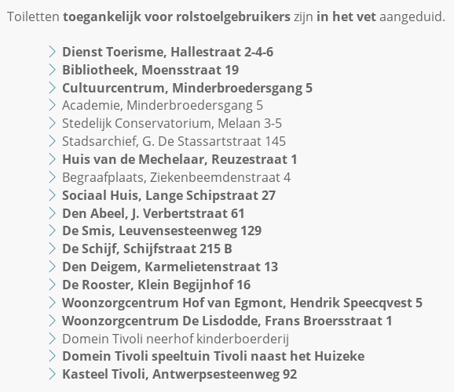
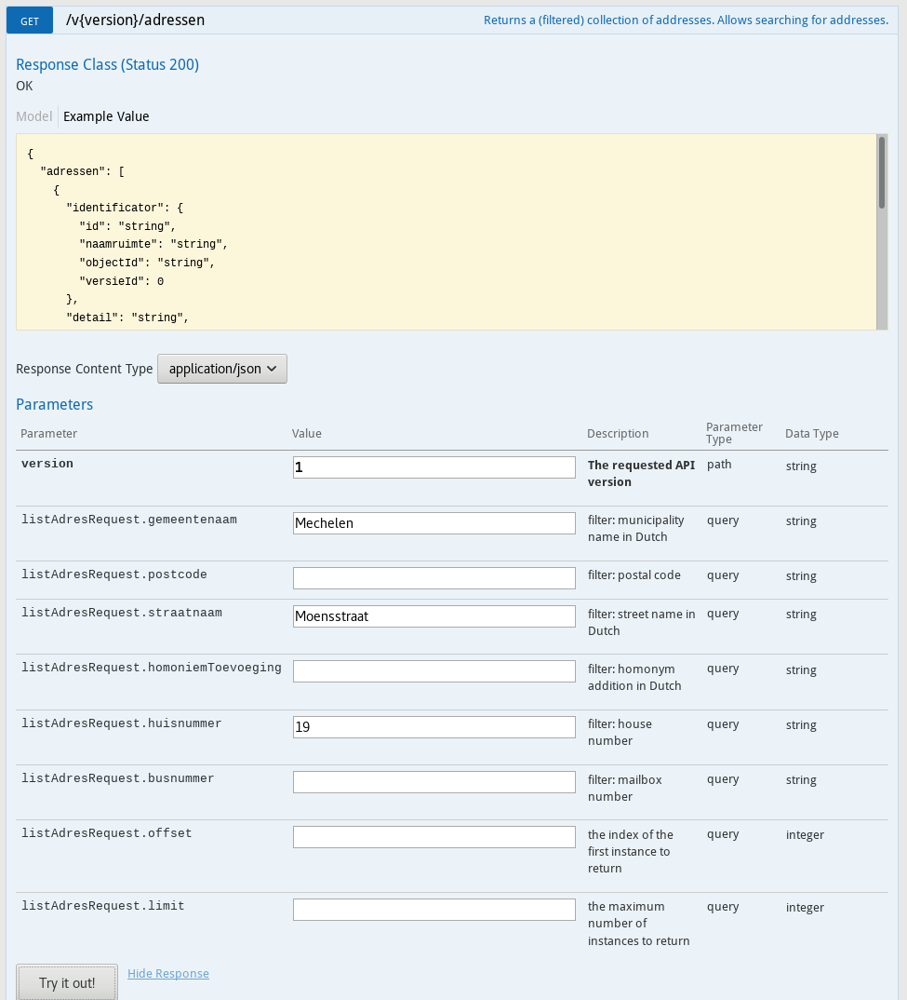
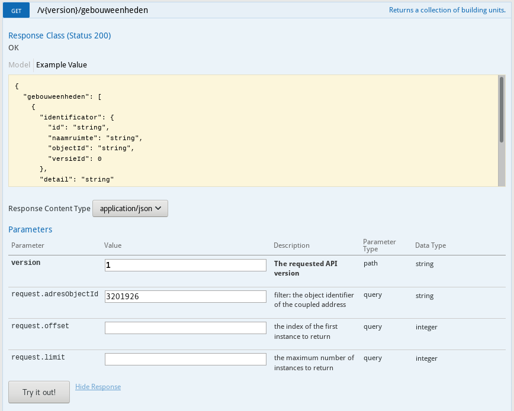
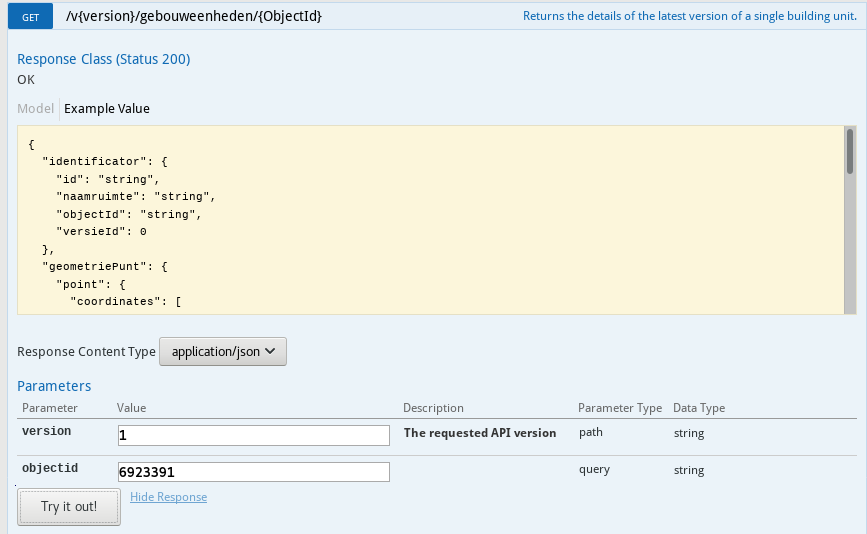

## The current situation



We found this data on a city website about the public toilets and their accessibility.
To indicate that a toilet is accessible by people in a wheelchair they highlighted it in bold.

This way has several problems when it comes to reusing data and unifying the experience:

- What do they mean by '*accessible*'? A wheelchair comes in several sizes, some of them can reach the toilet others might be stuck at the entrance door because it can be too small.
- The data are not readable by machines. They have a Text-to-Speech engine on their website for deaf people, it won't see the difference.
- Other cities are using another approach to publish this data like for example: [Toegankelijkheid Vlaanderen](https://toevla.vlaanderen.be). It's difficult to find where the information is available for each city.

## Solutions for this situation

Several solutions can be used to publish this the data better. You could move all this data to Toegankelijkheid Vlaanderen and let them handle this on their own.
They will define their own vocabulary to do this, the data will be better published, but not machine readable and their reports are very long to see if the toilet is accessible or not.

We handled this problem differently by using Linked Open Data. We linked several data sets together to provide the user a unifying way to access all the data he or she needs.
This way we keep the responsibility at the cities for the opening hours for example, something that Toegankelijkheid Vlaanderen does not cover.
The accessibility data can be published for example by city, Toegankelijkheid Vlaanderen, ... while it's still connected to the opening hours.
The data are now also machine readable by using RDF ([Resource Description Framework](https://en.wikipedia.org/wiki/Resource_Description_Framework)) to describe what the data are meaning, it provides context.
Using RDF we can define exactly what '*accessibility*' is and let other parties reuse the vocabulary. If a machine reads the vocabulary it can understand what the data are meaning. This wasn't the case with the bold public toilets in our example above.

## Fixing the example

When we think of a public toilet which things are very important for the user of the public toilet?

- [Accessibility for disabled people](https://www.mechelen.be/openbare-toiletten-toegankelijkheid)
- [Where](https://mechelen.bibliotheek.be/adres-en-openingsuren)
- [Point of contact](https://toerisme.mechelen.be/visitmechelen)
- [Opening hours](https://www.openingsurengids.be/dienst-toerisme/mechelen/1)
- ...

The links above illustrate perfectly the current problem as we mentioned above:

1. You need to look up the location of the public toilets
2. You need to search (by matching the address, in this case) who is responsible for the toilet in case something goes wrong on another page
3. The opening hours are mentioned on some other pages as well.

To keep this example simple we will describe the first 3 things, more can be added later on.
We will use [JSON-LD](https://json-ld.org/) to describe to public toilet. The reason for this is pretty simple: Google, Bing, ... support this out-of-the-box. When you use one of these search engines they will show you show you some information already in the search results using JSON-LD. If you want to have some help to correctly write JSON-LD, you can use their [JSON-LD playground](https://json-ld.org/playground/).

The address and building registries are managed by the Flemish government in the [CRAB database](https://basisregisters.vlaanderen.be/api/swagger/ui/index#/). There's no need to create your own vocabulary to describe the building or the address, it's already available with the correct URI (You can find more information about URI and why they are important [here](https://osoc18.github.io/SmartFlanders-blog/Missing-URI/)).

```
{
  "@context": {
    "gebouwenRegister": "http://data.vlaanderen.be/id/gebouw/",
    "adressenRegister": "https://data.vlaanderen.be/id/adres/",
    "gebouw": "http://data.vlaanderen.be/ns/gebouw#",
    "schema": "http:/schema.org",
    "locn": "http://www.w3.org/ns/locn#",
    "geo": "http://www.opengis.net/ont/geosparql#",
    "description": "http://purl.org/dc/terms/description",
    "xsd": "http://www.w3.org/2001/XMLSchema#"
  },
  "@id": "gebouw:6921454",
  "@type": "gebouw:Gebouw",
  "schema:name": "Public toilet library",
  "description": "The public toilet of the public library of Mechelen",
  "gebouw:Gebouw.adres": {
    "@id": "http://data.vlaanderen.be/id/adres/3201926",
    "@type": "http://www.w3.org/ns/locn#Address",
    "http://www.w3.org/2003/01/geo/wgs84_pos#location": {
      "@type": "http://www.w3.org/2003/01/geo/wgs84_pos#Point",
      "http://www.w3.org/2003/01/geo/wgs84_pos#lat": 51.0236222,
      "http://www.w3.org/2003/01/geo/wgs84_pos#long": 4.4767404
    }
  },
  "schema:openingHours": ["Tu 10:30-19:30", "We 10:30-17:00", "Th 10:30-19:30", "Fr 10:30-17:00", "Sa 10:00-16:00"],
  "schema:contactPoint" : [
    {
      "@type": "ContactPoint",
      "telephone": "015 40 44 70",
      "email": "uitleen.bibliotheek@mechelen.be",
      "contactType": "operator"
   }
  ]
}
```

### Let's look up the building URI and address URI in the CRAB database:

#### Address

**/v{version}/adressen** enter the city, street name and number of the address. After clicking 'Try it out!' you will find the address URI under `adressen[{addressNumber}].identificator.id`, the address ID is shown in the `adressen[{addressNumber}].indentificator.objectId` property in the JSON response. If a building has multiple numbers then you need to add multiple address identifiers!



JSON answer:

```
{
  "adressen": [
    {
      "identificator": {
        "id": "http://data.vlaanderen.be/id/adres/3201926",
        "naamruimte": "http://data.vlaanderen.be/id/adres",
        "objectId": "3201926",
        "versieId": 14
      },
      "detail": "https://basisregisters.vlaanderen.be/api/v1/adressen/3201926",
      "huisnummer": "19",
      "busnummer": "",
      "volledigAdres": {
        "geografischeNaam": {
          "spelling": "Moensstraat 19, 2800 Mechelen",
          "taal": "NL"
        }
      }
    }
  ],
  "totaalAantal": 1
}
```

The address objectID = *3201926*.

#### Building unit

**/v{version}/gebouweenheden** reuse the address identifier to identify the building unit. Add the `objectId` from the address JSON response to the `request.adresObjectId` field and fire up the request. The building unit URI associated with the address can be found under `gebouweenheden[{buildingUnitNumber}].identificator.id`, ID under `gebouweenheden[{buildingUnitNumber}].identificator.objectId`.



JSON answer:

```
{
  "gebouweenheden": [
    {
      "identificator": {
        "id": "http://data.vlaanderen.be/id/gebouweenheid/6923391",
        "naamruimte": "http://data.vlaanderen.be/id/gebouweenheid",
        "objectId": "6923391",
        "versieId": 2
      },
      "detail": "https://basisregisters.vlaanderen.be/api/v1/gebouweenheden/6923391"
    }
  ],
  "totaalAantal": 1
}
```

The building unit ID = *6923391*.

#### Building itself

**/v{version}/gebouweenheden/{ObjectID}** using the building unit ID we can retrieve the information about the building unit and learn more about the building itself. The building ID can found under `gebouw.objectId`. The URI of the building is available in the property: `gebouw.detail`.



JSON answer:

```
{
  "identificator": {
    "id": "http://data.vlaanderen.be/id/gebouweenheid/6923391",
    "naamruimte": "http://data.vlaanderen.be/id/gebouweenheid",
    "objectId": "6923391",
    "versieId": 2
  },
  "geometriePunt": {
    "point": {
      "coordinates": [
        157568.56,
        190383.56
      ],
      "type": "Point"
    }
  },
  "positieGeometrieMethode": "AangeduidDoorBeheerder",
  "gebouweenheidStatus": "Gerealiseerd",
  "functie": "NietGekend",
  "gebouw": {
    "objectId": "6921454",
    "detail": "https://basisregisters.vlaanderen.be/api/v1/gebouwen/6921454"
  },
  "adressen": [
    {
      "objectId": "3201926",
      "detail": "https://basisregisters.vlaanderen.be/api/v1/adressen/3201926"
    }
  ]
}
```

The building ID = *6921454*.

### Name & description

Defines the name and some more information about the toilet. You can put here anything you want, it's handy for users to show them what this data is describing.

### Opening hours

Using the `schema.org` specification we can easily add machine readable opening hours to our JSON-LD. You have to respect the format as described [here](https://schema.org/openingHours). If you need to describe closing days, periods, ... you can use the [https://schema.org/OpeningHoursSpecification](https://schema.org/OpeningHoursSpecification) in combination with the previous one.

### Contact point

Again, we can use the `schema.org` specification to describe our point of contact, a lot of examples are already available to describe this easily. You can find more information [here](https://schema.org/ContactPoint). The `contactType` property describes the type of contact (support, operator, sales, ...), if you're in doubt about some properties you can always look into the specification of the vocabulary. Every property is strictly defined what it means and when it may be used.
