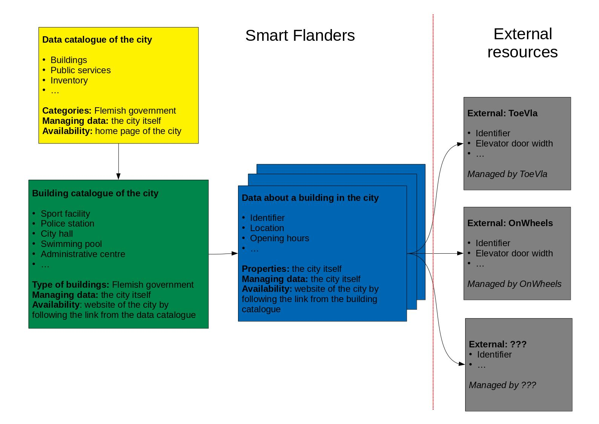

## Finding and accessing open data can be a challenge

Some cities already publish a list of their data on a data portal or in a data catalogue.
A data portal is a website where you can browse through all the available data sets that they publish.

For example, you want to have statistics about the population in the city you can easily find it under the 'Bevolking' umbrella.
However, what if cities actually publish their data, but don't have a portal? Several things may happen:

- The data sets are spread around several pages and not easily to find
- They are never mentioned on their website
- ...

The consequence of this is very straightforward: almost nobody can use the data because they don't know it exists.
That's why data portals and catalogues are very important when you are informing people about your data sets!
It provides also some insight in the quality of the data, if the data are up to date, ... for the user.

## Publishing Linked Open Data catalogues

We, the Smart Flanders team, want to publish the accessibility data of buildings in the centre cities of Flanders as a Proof-Of-Concept.
Once you have your vocabulary ready, you can publish your Linked Open Data (see our [previous post](https://osoc18.github.io/SmartFlanders-blog/Example-Public-Toilets/)).
There's a small issue: How are those Linked Open Data fragments linked to each other? A building catalogue!

1. Data catalogue of the city containing all types of categories, the same as on the data portal above: Bevolking, Veiligheid, Wonen, ...
2. Each entry of the above catalogue points to a new catalogue, we focus on the building catalogue for now. The building catalogue contains links to all kinds of building in the city.
3. If you follow the building catalogue link you get the information about the building you requested. The information can go from opening hours to accessibility data and so on.
4. External parties can be linked to the building to provide even more data, for example: ToeVla, OnWheels, ... can provide additional or more detailed data about the accessibility of the building.

<!--### A real life example

TO DO-->
