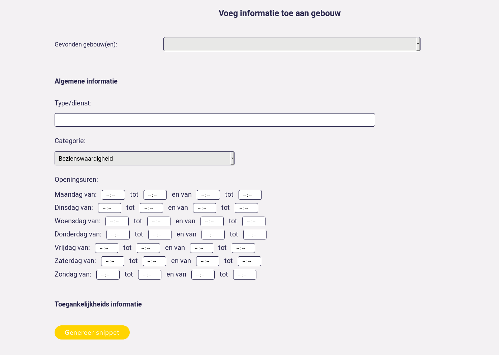

Using the stuff of somebody else might be a challenge if there's no documentation around.
This blogpost is trying to explain the workflow of the Smart Flanders tool we're building to help the civil servant to publish it's data as Linked Open Data in a good way.

## Let the games begin! 

First things first: get a cup of coffee, relax a bit and then go to our website where we host our tool: [smartflanders.ilabt.imec.be](http://smartflanders.ilabt.imec.be).

As soon as you land on our page you will find our tool. To get started you need some information about the building (the address) where the service is active.
Click on 'Zoek gebouw via adres' and you will go to the next phase where you can enter the building data in the form:

When you're done, submit the data to the server by clicking on 'Zoeken'.

## Adding data to the building

Since you submitted the data to the server, the server will contact the CRAB database and ask for more information about the building.
However, some things aren't available yet as open data like opening hours. You can enter them in the form to generate the JSON-LD snippet you can embed into your website.
You can embed the JSON-LD snippet using your website CMS like any other HTML or directly add it to your HTML code.

                                                                                                                                                                                                                  
