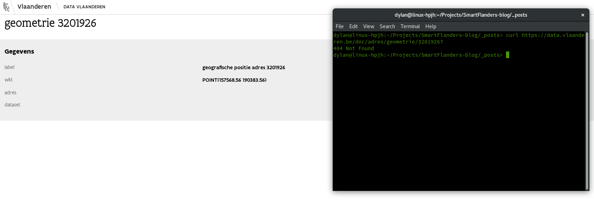
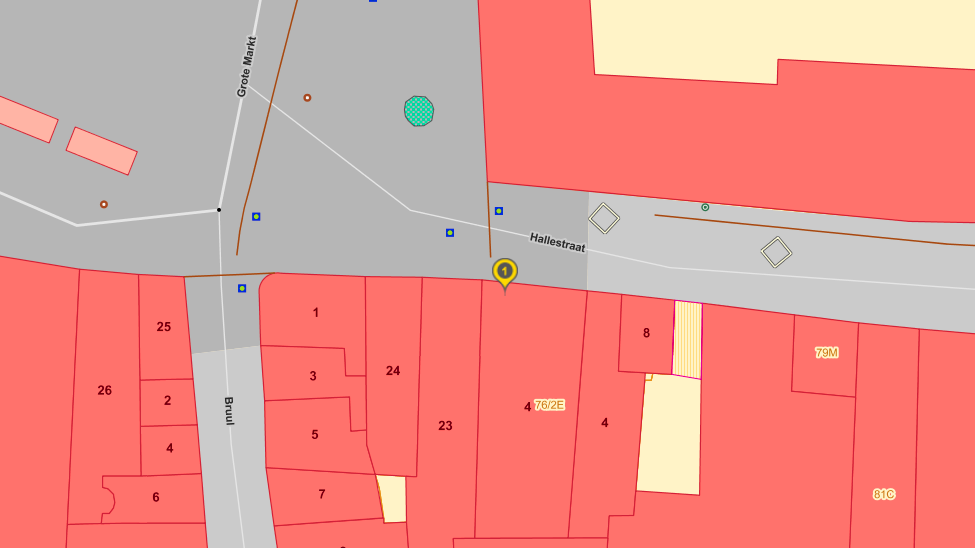

Using other people their open data is a nice idea. But what if their an error in their data? In this blog post we will take a look at several examples and what you can do this to fix the errors in the data.

## The URI is a dead-end

### Ideal situation

In an ideal Linked Open Data  world every URI will have a resource behind it. The resource will tell then more about the object you requested.
However, nothing is ideal or perfect in this world. Let's take for example the CRAB database, a huge database containing all the Belgian addresses.

### Example

If you look up a building you can find the geometry of the building, if you read the same data using a machine the URI will return a HTTP 404 page.
For humans, the resource exist but for machine it's unavailable.

We contacted the responsible organisation behind the CRAB database to fix this issue. It's clearly a bug in their routing system since the resource is available for humans.

## Data is out-of-date with the real world

### Blazing fast

Everything in the real world can change so fast that's hard to keep up with it in your data set.
It takes some time before the changes are visible in the data sometimes.
In a perfect situation the data is updated together with the change in the real world, this isn't always possible due paperwork, responsibilities, ...

### Example

The Dienst Toerisme of the city of Mechelen is located in the Hallestraat 2-4-6 in Mechelen. If you lookup the address identifiers for the Hallestraat 2 and 4 you get a hit in the CRAB database.
This isn't the case when you look up the Hallestraat 6, CRAB doesn't know it but it's really existing in the real world. As you can see on the map, the number 4 is displayed 2 times, a mistake in the CRAB database.

We contacted the responsible organisation behind the CRAB database to fix this issue. Probably a miscommunication between several organisations.

